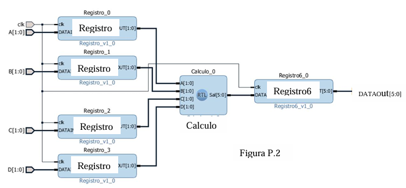

# Laboratorio 4

## Problema 2
Escribir una descripción en Verilog para el circuito de la figura.



Nota: nos proporcionan los códigos de:
- Cálculo
- Registro
- Registro 6

Contenidos en la carpeta `./src/Clase`

Escribimos el código para implementar el circuito, de una forma jerárquica:
```v
module p2(
    input [1:0] A, B, C, D, // Van a ser las entradas del circuito de 2 bits.
    input clk, // Reloj del sistema
    output [5:0] DATAout // Salida del circuito, tras pasar por la cuenta y los registros.
    );
    
    // Declaración de las conexiones entre los módulos con wire
    wire [1:0] cable_A, cable_B, cable_C, cable_D;
    wire [5:0] cable_salida;
    
    // Se instancian los módulos necesarios
    Registro RA(clk, A, cable_A);
    Registro RB(clk, B, cable_B);
    Registro RC(clk, C, cable_C);
    Registro RD(clk, D, cable_D);
    
    // Calculo
    Calculo CAL(cable_A, cable_B, cable_C, cable_D, cable_salida);
    
    // Se instancia el módulo de salida
    Registro6 R6(clk, cable_salida, DATAout);
    
endmodule
```

Para hacer el TestBench:
```v
```